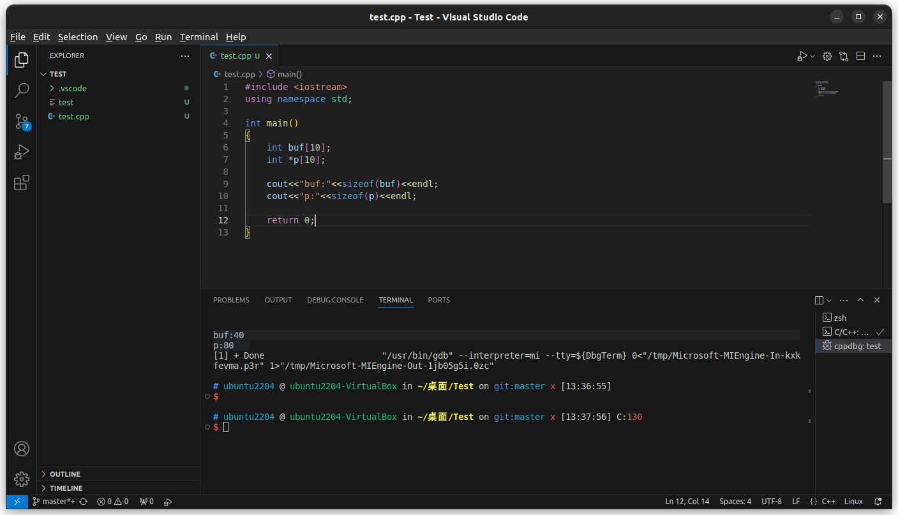

# 一
```cpp
#include <iostream>
using namespace std;

int main()
{
    int arr[10];
    cout<<"arr:"<<arr<<endl;
    cout<<"&arr"<<&arr<<endl;
    cout<<"&arr[0]"<<&arr[0]<<endl;
    return 0;
}
```

**运行结果**
```
arr:0x7fffffffd890
&arr:0x7fffffffd890
&arr[0]:0x7fffffffd890
```

**结论**

根据结果可知，三种表达方式都是数组头部的地址


# 二

```cpp
#include <iostream>
using namespace std;

int main()
{
    int buf[10];
    int *p[10];

    cout<<"buf:"<<sizeof(buf)<<endl;
    cout<<"p:"<<sizeof(p)<<endl;

    return 0;
}
```

**运行结果**
```
buf:40
p:80
```



# 三

```cpp
#include <iostream>
using namespace std;

int main()
{
    int data[3][4] = {{1, 1, 1, 1}, {2, 2, 2, 2}, {3, 3, 3, 3}};

    int *p[3][4];

    for (int i = 0; i < 3; i++)
    {
        for (int j = 0; j < 4; j++)
        {
            *(*(p + i) + j) = &data[i][j];
        }
    }

    for (int i = 0; i < 3; i++)
    {
        for (int j = 0; j < 4; j++)
        {
            cout << **(*(p + i) + j) << " ";
        }
    }

    return 0;
}
```

**运行结果**
```
1 1 1 1 2 2 2 2 3 3 3 3
```


