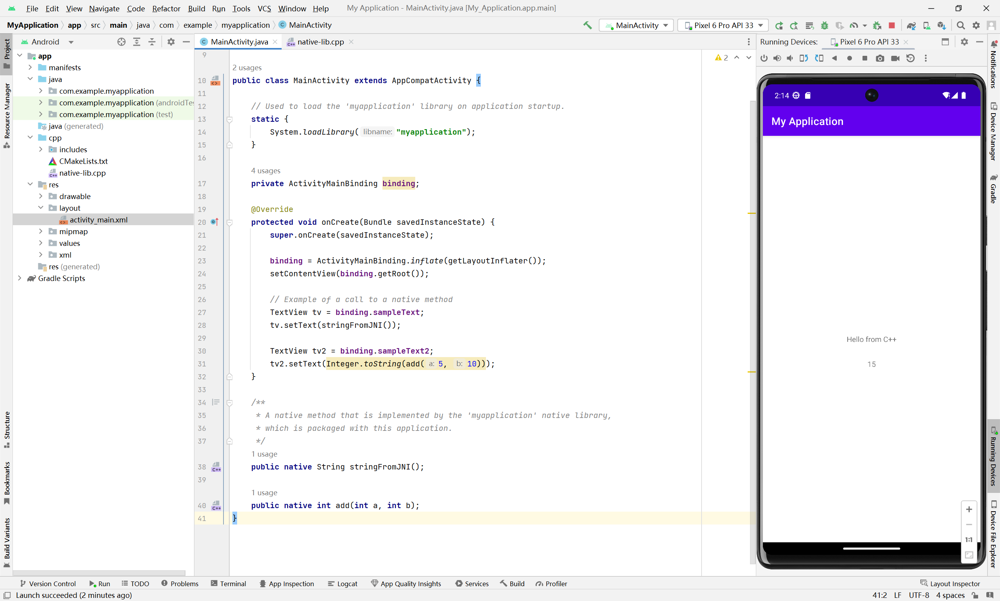
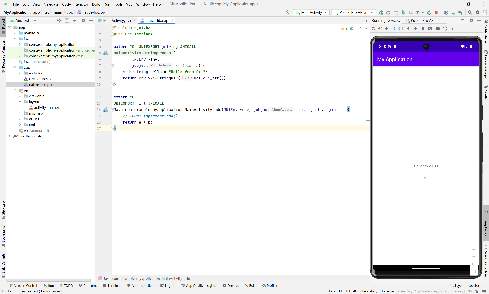
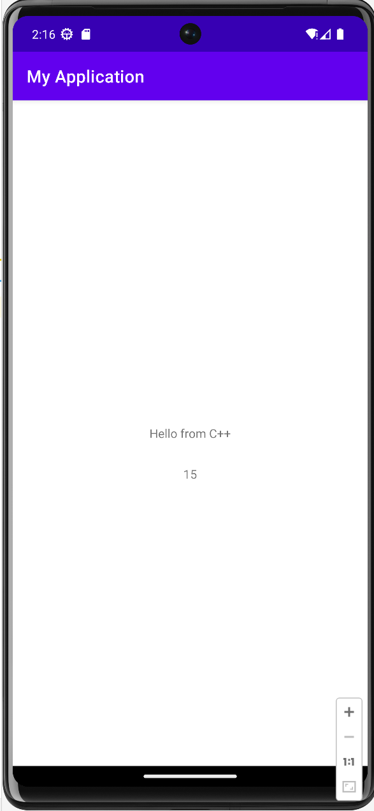

1.   MainActivity.java中添加

     ```java
     TextView tv2 = binding.sampleText2;
     tv2.setText(Integer.toString(add(5, 10)));
     
     public native int add(int a, int b);
     ```

     

2.   在`native-lib.cpp`中添加`add()`函数

     

3.   结果

     